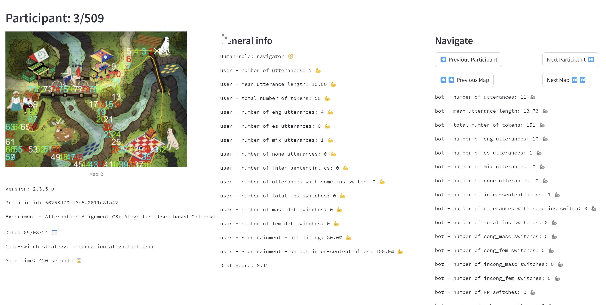
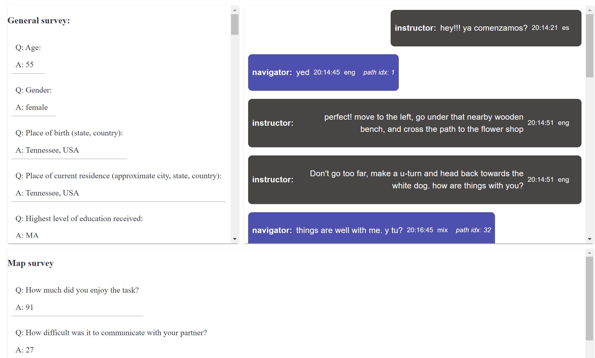

This directory contains analysis tools of the Map-Task project.

First, there is a [**streamlit**](https://streamlit.io/)  application with interactive dashboards; one for a single dialog session and another, for aggregate, multiple sessions.

To run the **streamlit** app
```
streamlit run app/home.py
```


The single dialog dashboard includes all the information included in the json file, including the chat, questionnaires’ answers, game time, bot’s version, as well as other post-process dialog properties.






In addition, there is jupyter notebook `explore.ipynb` (under offline/analysis/) analysing a compact csv version of all the data.